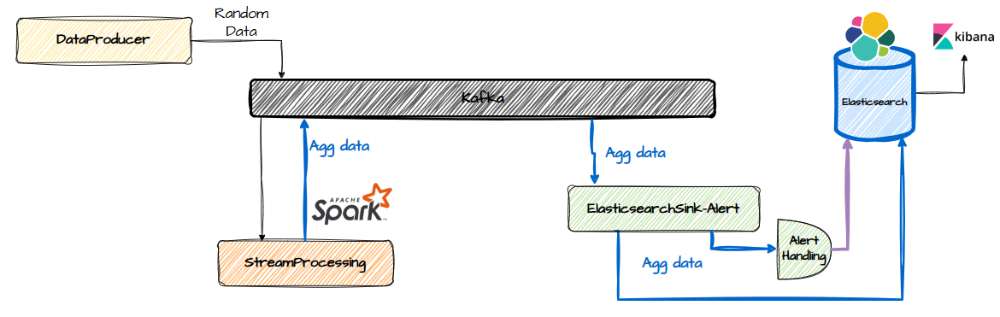
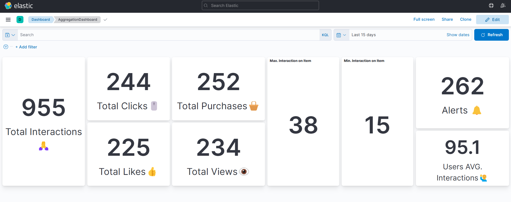
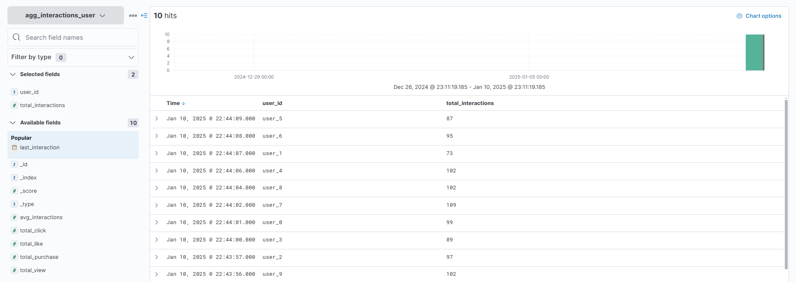
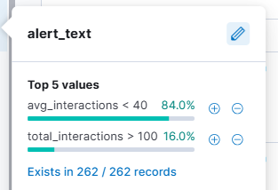
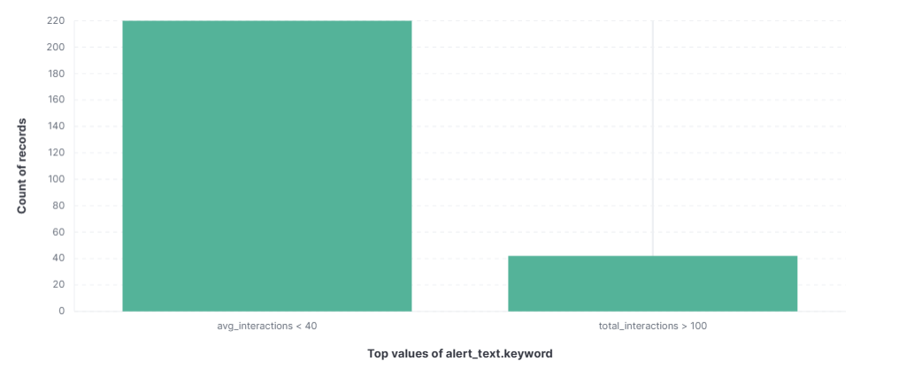

# AvroicTHA Project

A scalable data pipeline demonstrating real-time user interaction analytics using modern data stack technologies.

This project demonstrates a data pipeline using **Kafka, Spark, and Elasticsearch**. It is divided into three main components:

<p align="center">
    
</p>

- **01-DataProducer:** Generates random user-item interactions and sends them to Kafka.
- **02-StreamProcessing:** Uses Spark to consume data from Kafka, aggregate interactions in real-time, and send aggregated results to another Kafka topic.
- **03-ElasticsearchSink-Alert**
  - **Storage:** Consumes aggregated data, stores them in Elasticsearch, and raises alerts based on predefined criteria.
  - **Alert:** Parallel with saving data, raises alerts based on predefined criteria.

## Architecture Overview
1. **Kafka Producer**: Sends random interaction data.
2. **Spark Streaming**: Reads, processes, and aggregates that data. Spark app uses DeltaTable as main storage.
3. **Kafka Consumer**: Processes data pushed back to Kafka and indexes it into Elasticsearch.
4. **Alert System**: Generates alerts when certain conditions are met.

## Components

### 01-DataProducer
This component generates random user-item interactions and sends them to a Kafka topic. It simulates user activities such as likes, clicks, views, and purchases.

#### Schema
```json
{
    "user_id": "user_765",             // user id as string
    "item_id": "item_43",              // item id as string
    "interaction_type": "interaction", // like, view, click, or purchase
    "timestamp": 1736404972            // Timestamp
}
```

### 02-StreamProcessing
This component uses Spark Streaming to consume data from Kafka, perform aggregations, and send the results to another Kafka topic. It processes user interactions to compute metrics like total interactions, average interactions, etc.

#### Tables

| Table Name            | Columns                                       | Note                                                          |
|-----------------------|-----------------------------------------------|---------------------------------------------------------------|
| `interactions`          | user_id, item_id, interaction_type, timestamp | Parsed interaction data from kafka. Save with Spark Table API |
| `agg_interactions_user` | user_id, total_click, total_like, total_view, total_interaction, avg_interactions | Aggregated metrics per user |
| `avg_interactions`      | avg_interactions, last_interaction            | Totally aggregated metrics per user                             |
| `agg_interactions_item` | item_id, min_interactions, max_interactions   | Aggregated metrics per item                                     |

### 03-ElasticsearchSink-Alert
This component consumes aggregated messages from Kafka, stores them in Elasticsearch, and raises alerts based on predefined criteria. It checks for conditions like maximum interactions and generates alerts accordingly.

> Elasticsearch **index** **and** id defined based on message `KEY` in kafka. Data parsing based on data mapper that we defined.

#### Data Mapper
```json
{
    "agg_interactions_item": {                      // define index
        "id": "item_id",                            // define which item is ID
        "alerts": [("max_interactions", ">", 12)],  // list of defined alert
    },
    "agg_interactions_user": {
        "id": "user_id",
        "alerts": [("total_interactions", ">", 100),
                   ("avg_interactions", "<", 40)],
    },
    "avg_interactions": {
        "id": "avg_interactions"
    }
}
```


## Requirements
- Docker and Docker Compose
- Python 3.x
- Kafka
- Confluent Kafka Python Client
- Apache Spark 3.5.0
- PySpark
- Elasticsearch 7.17
- Kibana 7.17

## Environment Variables
```bash
# Data Producer Settings
RANDOM_DATA_MAX_USERS: 10  # Distribution of Users
RANDOM_DATA_MAX_ITEMS: 10  # Distribution of Items
PRODUCER_RATE: 1           # Interval between producing data

# Spark APP Configuration
DEPLOY_MODE: client        # Spark deploy mode
LOOP_SLEEP: 2              # Interval when there is no new data in kafka,
                           # important for efficency
```

## Alert System Details
The system monitors various metrics and generates alerts based on these conditions:
- `>` Operation: Alert when `max_interactions > 12`
- `<` Operation: Alert when `total_interactions > 100`
- `==` Operation: Alert when `avg_interactions == 40`

## Deployment Steps
1. Clone the repository
2. Set up environment variables
3. Build Docker images
4. Run the services:
```bash
docker-compose up -d
```

## Monitoring
- View Kafka topics using Kafka UI at http://localhost:8080
- Monitor Elasticsearch indices at http://localhost:9200
- Check alerts in the 'alerts' index

### Kibana Real-Time Dashboard

- Aggregates by user
- Calculates average interactions
- Tracks item-level statistics

<p align="center">
    
</p>

<p align="center">
    
</p>


### Alerts

<p align="center">
    
</p>
<p align="center">
    
</p>


## Troubleshooting
- Ensure all services are running: `docker ps`
- Check service logs: `docker logs <container-name>`
- Verify Kafka topics: `kafka-topics --list --bootstrap-server localhost:9092`
